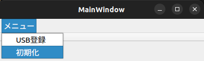
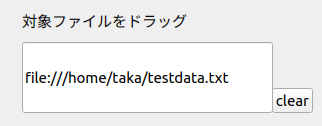
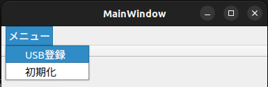

[](https://github.com/taka0628/sechack365/actions/workflows/test.yml)
[](https://github.com/taka0628/sechack365/actions/workflows/setup.yml)

# ファイル暗号化システム

## 概要
ファイルを暗号化して保存することでデータ流出を防ぎます

## 仕様
* 暗号化方式
  * AES-256(CTR)
  * SHA-256
* ファイルごとに異なる鍵を使用
  * ファイルごとの鍵をまとめた”鍵リスト”を作成し、鍵リストを認証情報で暗号化
* 認証方法
  * パスワード+USBメモリのシリアル番号
* 詳しい動作はこちらを参照
  * https://sechack365.nict.go.jp/achievement/2021/index.html

## INSTALL
* 使用パッケージ
  * make
  * docker
  * qtbase5-dev
  * qttools5-dev-tools
```
make install
make docker-build
make build
cd build
./fileEncSys.out
```

## 使い方

### 暗号化
注) 暗号化と復号の際には初期化時に選択したUSBメモリが必要です

1. プログラムを実行
  	```
	cd build
	./fileEncSys.out
 	```
1. "メニュー" --> "初期化"を選択

	
2. パスワードを入力
3. 使用するUSBメモリを選択
   * root権限が必要
4. 暗号化するファイルを入力し"encrypt"をクリック

	
5. パスワードを入力
6. 暗号化完了！

### 復号
1. 復号するファイルを入力
2. パスワードを入力
3. 復号完了！

### USBメモリの追加
1. 初期化時に登録したUSBメモリが刺さった状態で”メニュー” --> ”USB登録”を選択

	
2. パスワード入力
3. 完了！
	* これ以降、新たに登録したUSBでも暗号化、復号が可能になります

## 開発環境

### 環境構築
* テスト環境の構築
	```
	make installDev
	cd test
	make docker-build
	```
* テストの実行
	```
	# testディレクトリ内
	make build
	make run
	```